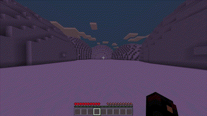
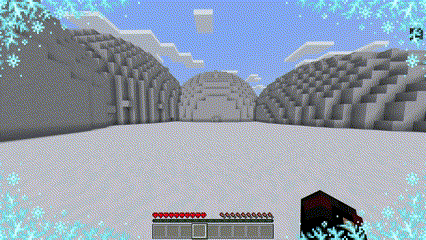

# Frozen
---
_Freezes the player at night, midnight and sunrise in the biomes specified in the config_

## NOTE:
_If you want the plugin to run smoothly, install the pack named 'resources/Frozen.mcpack' on your server_

### Features:
* Custom freeze animation overlaying the screen
* Player takes damage when frozen
* Receives a slowness effect when the player freezes
* Special sound effect is sent when the player freezes 
* Sends a message when the player freezes  
  
_Some properties can be changed in config_  

---

### Clips:

